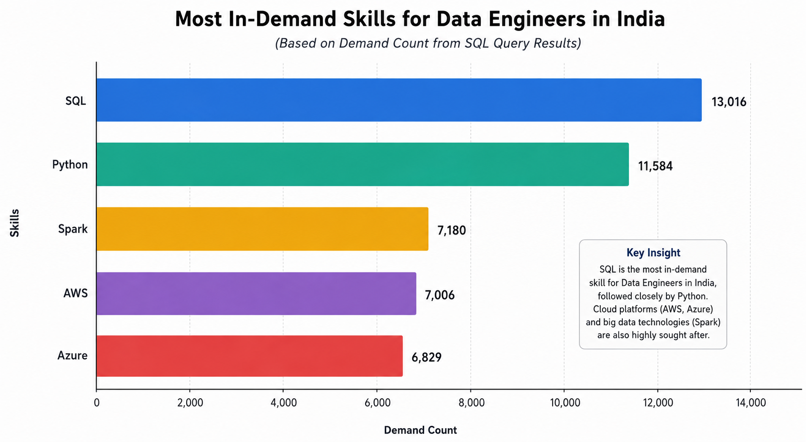
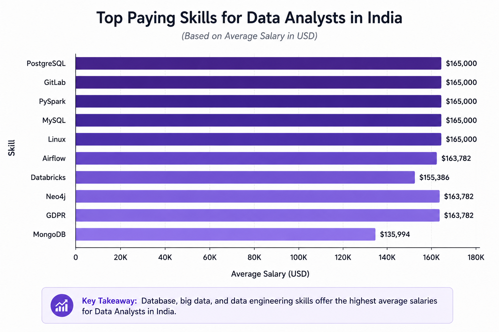

# INTRODUCTION

The data industry is evolving rapidly, with new tools and technologies becoming industry standards every year. Rather than relying on opinions or isolated job postings, this project analyzes real-world job market data to identify the skills employers value most.

Using SQL, this project explores salary trends, in-demand technologies, and the relationship between skill demand and compensation across multiple data-related careers in India, including:

- Data Analyst
- Data Scientist
- Data Engineer

The objective is to uncover actionable insights that can help aspiring data professionals prioritize the right skills for career growth.

## Dataset

This project uses the 2023 Data Jobs Dataset, created by Luke Barousse, a well-known data educator and content creator in the analytics community.

The dataset powers Data Nerd, a platform that collects job postings daily from Google Jobs, extracts skills, normalizes job titles, and tracks salary trends across more than 170 countries. Although the platform updates continuously, this project specifically analyzes the 2023 job postings dataset.

Dataset Highlights
- 📌 Real-world job postings from 2023
- 🌍 Global job market coverage
- 🇮🇳 Analysis focused on India
- 💼 Hundreds of thousands of job listings
- 🛠 Extracted technical skills from job descriptions
- 💰 Salary information (where available)
- 🏢 Company information
- 📍 Job locations
- 📄 Standardized job titles

## Project Objectives

This analysis aims to answer the following business questions:

1. Which companies offer the highest-paying Data Analyst and Data Scientist roles in India?
2. What skills are required for these high-paying positions?
3. Which skills are most in demand for Data Engineers?
4. Which skills command the highest salaries for Data Analysts?
5. Which technologies offer the best combination of high demand and high salary across data-related careers?

## Key Insights

💰 Highest Paying Jobs:
- Data Scientist roles offered a higher average salary than Data Analyst roles.
Premium salaries were largely offered by multinational organizations.
- Most high-paying opportunities clustered around a common salary band, while a few specialized roles commanded significantly higher compensation.

🛠 Skills Behind High Salaries:
- SQL and Excel remained the most frequently requested skills.
- Python consistently appeared across top-paying opportunities.
- Cloud platforms such as AWS and Azure were increasingly common.
- Data Scientist roles required a broader technical stack, including machine learning and big data technologies.

📈 Most In-Demand Skills:

For Data Engineering roles, the market strongly favored the following skills displayed in the bar chart.

These technologies formed the foundation of modern data infrastructure roles.

💵 Highest Paying Skills:

The best-paying Data Analyst skills extended beyond traditional analytics tools.

This suggests that analysts with engineering-oriented skills can command significantly higher salaries.

🚀 Optimal Skills to Learn:

By combining salary with market demand, the analysis identified several standout technologies:

- Apache Spark
- Kafka
- Airflow
- TensorFlow
- PyTorch
- Scala

These skills provide one of the strongest balances between job opportunities and earning potential.

## Conclusion
This project demonstrates how SQL can be used to extract meaningful business insights from large-scale job market data. By analyzing salary trends, skill demand, and employer requirements, the project highlights the technologies that offer the greatest career value for aspiring data professionals.

The findings reinforce that while foundational skills such as SQL and Python remain indispensable, expertise in cloud computing, distributed data processing, and machine learning frameworks increasingly differentiates candidates in today's competitive job market.
